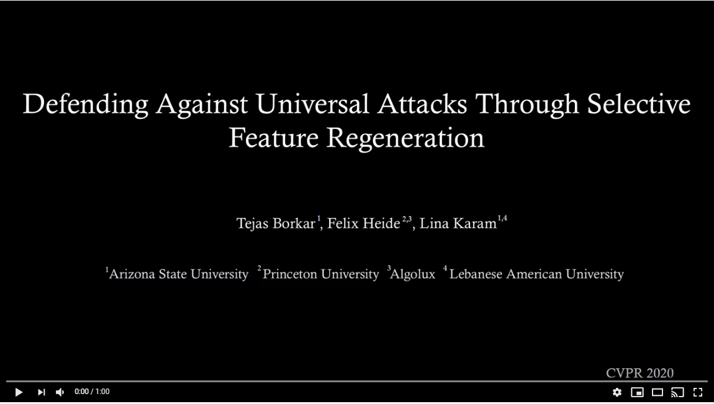
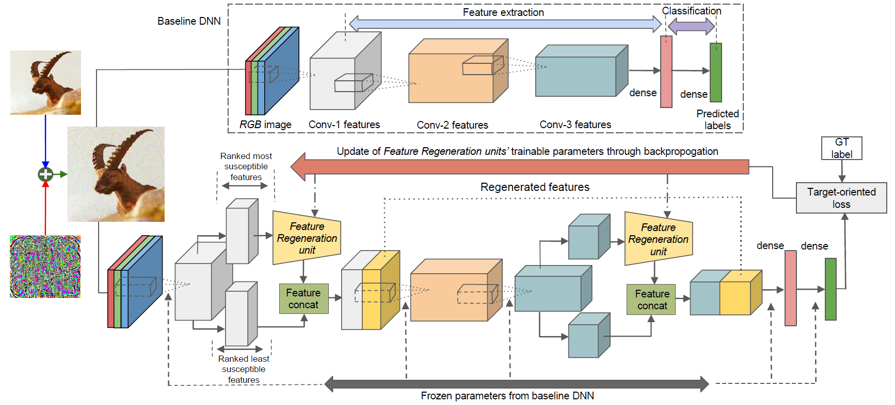
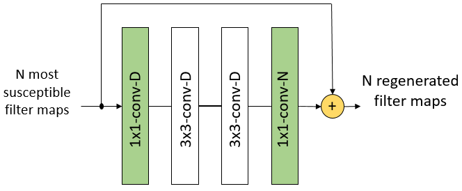
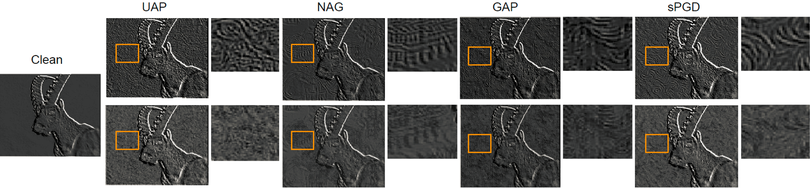

#  Defending Against Universal Attacks Through Selective Feature Regeneration (CVPR 2020)
 [](https://youtu.be/wMWhb7xqubg)

## Introduction
<p align="justify">
Deep neural network (DNN) predictions have been shown to be vulnerable to carefully crafted adversarial perturbations. Specifically, image-agnostic (universal adversarial) perturbations added to any image can fool a target network into making erroneous predictions. Departing from existing defense strategies that work mostly in the image domain, we present a novel defense which operates in the DNN feature domain and effectively defends against such universal perturbations. Our approach identifies pre-trained convolutional features that are most vulnerable to adversarial noise and deploys trainable feature regeneration units which transform these DNN filter activations into resilient features that are robust to universal perturbations. Regenerating only the top 50% adversarially susceptible activations in at most 6 DNN layers and leaving all remaining DNN activations unchanged, we outperform existing defense strategies across different network architectures by more than 10% in restored accuracy. We show that without any additional modification, our defense trained on ImageNet with one type of universal attack examples effectively defends against other types of unseen universal attacks. 

A complete description of our CVPR 2020 work can be found in the pre-print on [ArXiv](https://arxiv.org/abs/1906.03444) as well as at the [Project Page](https://www.cs.princeton.edu/~fheide/SelectiveFeatureRegeneration/). </p>

## Proposed Defense



<p align="justify"><em><b>
Defending Against Adversarial Attacks by Selective Feature Regeneration: Convolutional filter activations in the baseline DNN (top) are first sorted in order of vulnerability to adversarial noise using their respective filter weight norms (see Manuscript). For each considered layer, we use a feature regeneration unit, consisting of a residual block with a single skip connection (4 layers), to regenerate only the most adversarially susceptible activations into resilient features that restore the lost accuracy of the baseline DNN, while leaving the remaining filter activations unchanged. We train these units on both clean and perturbed images in every mini-batch using the same target loss as the baseline DNN such that all parameters of the baseline DNN are left unchanged during training. </b></em></p>

### Feature Regeneration Unit (FRU)
<p align="center">
</p>

<p align="justify"><em><b>
FRU acting on the activations of the N most susceptible filters in a DNN layer. D represents the FRU kernel depth and
has a default value of N. All convolutional layers except the final 1×1 layer are also followed by batch normalization and a ReLU
non-linearity. # parameters per FRU ≈ 18D^2 + 2ND.
 </em></b></p>

### Robust Feature Regeneration



<p align="justify"><em><b>
Effectiveness of feature regeneration units at masking adversarial perturbations in DNN feature maps for images perturbed by universal perturbations (UAP, NAG, GAP and sPGD). Perturbation-free feature map (clean), different adversarially perturbed feature maps (Row 1) and corresponding feature maps regenerated by feature regeneration units (Row 2) are obtained for a single filter channel in conv1 1 layer of VGG-16, along with an enlarged view of a small region in the feature map (yellow box). Feature regeneration units are only trained on UAP attack examples but are very effective at suppressing adversarial artifacts generated by unseen attacks (e.g., NAG, GAP and sPGD).</em></b></p>

## Citation

If you use our code, models or need to refer to our results, please use the following:

```
@inproceedings{selectivefeatadvdef,
 author = {Tejas Borkar and Felix Heide and Lina Karam},
 booktitle = {Proceedings of the {IEEE} Conference on Computer Vision and Pattern Recognition ({CVPR})},
 title = {Defending Against Universal Attacks Through Selective Feature Regeneration},
 year = {2020}
}
```

## Key Results on ILSVRC2012 Validation Set

### Restoration accuracy for [Universal Adversarial Peturbations](https://arxiv.org/abs/1610.08401) (UAP)

|   Methods        |  [CaffeNet](https://papers.nips.cc/paper/4824-imagenet-classification-with-deep-convolutional-neural-networks.pdf)        |    [VGG-F](https://arxiv.org/abs/1405.3531)  |   [GoogLeNet](https://arxiv.org/abs/1409.4842)  |  [VGG-16](https://arxiv.org/abs/1409.1556)   |  [Res152](https://arxiv.org/abs/1512.03385)  |
| :-----------:  | :--------------: | :---------: |   :----------: |   :---------:  | :---------: |
|  Baseline      |   0.596          | 0.628       |      0.691     |       0.681    |   0.670     |
|  *Ours*        |   **0.976**      | **0.967**   |      **0.970** |     **0.963**  |  **0.982**  | 

Please refer to Table 2. in our paper for additional details.


### Restoration accuracy for unseen stronger UAP attack perturbations against CaffeNet

|  Method    |  Attack Strength = 15    |   Attack Strength = 20    |   Attack Strength = 25      |
| :---------:|  :--------:  |:---------:|:----------:|
| Baseline   |     0.543    |    0.525  |     0.519   |
| *Ours*     |     **0.952**    |    **0.896**  |     **0.854**   |

Our defense is trained on attack examples with an attack strength of 10. Please refer to Table 4. in our paper for additional details. 

### Restoration accuracy for other types of unseen universal attacks 

Our defense is trained only one UAP attack examples. Please refer to Table 5. in our paper for additional details.

<table>
<thead>
<tr>  
 <th align="center" rowspan="2"> Method </th>
 <th align="center" colspan="3"> CaffeNet</th>
 <th align="center" colspan="3"> Res152 </th>
</tr> 
 <tr>
  <th align="center"><a href="https://arxiv.org/abs/1707.05572"> FFF </a></th>
  <th align="center"><a href="https://arxiv.org/abs/1712.03390"> NAG </a></th>
  <th align="center"><a href="https://arxiv.org/abs/1709.03582"> S.Fool </a></th>
   <th align="center"><a href="https://arxiv.org/abs/1712.02328"> GAP </a></th>
  <th align="center"><a href="https://arxiv.org/abs/1801.08092"> G-UAP </a></th>
  <th align="center"><a href="https://arxiv.org/abs/1812.03705"> sPGD </a></th>
</thead>
 
 <tbody>
 <tr>
 <td align="center"> Baseline </td>
 <td align="center">  0.645 </td>
 <td align="center">  0.670 </td>
 <td align="center">  0.815 </td>
 <td align="center">  0.640 </td>
 <td align="center">  0.726 </td>
 <td align="center">  0.671 </td>
 </tr>
  
 <tr>
 <td align="center"> <em> Ours </em> </td>
 <td align="center"> <b> 0.941 </b> </td>
 <td align="center"> <b> 0.840 </b> </td>
 <td align="center"> <b> 0.914 </b> </td>
 <td align="center"> <b> 0.922 </b> </td>
 <td align="center"> <b> 0.914 </b> </td>
 <td align="center"> <b> 0.976 </b> </td>
 </tr>
 
 </tbody>
 
 </table>

## Dependencies
- [Python-2.7](https://www.python.org/download/releases/2.7/)
- [Caffe](https://caffe.berkeleyvision.org/) with python bindings and GPU support
- [h5py]((http://www.h5py.org/) 
- [numpy](http://www.numpy.org/)
- [matplotlib](https://matplotlib.org/) for displaying images

## Trained Defense Models

<table>
<thead>
 <tr>
  <th align="center" colspan="5"> Baseline (Click for download/details) </th>
 </tr>
</thead> 
 <tbody>
  <tr>
   <td align="center"> CaffeNet <a href="https://drive.google.com/file/d/1XD55nDLl3VzigJ5CueCtCcF-tMJL12b7/view?usp=sharing"> :arrow_down: </a> </td> 
   <td align="center"> VGG-F <a href="https://drive.google.com/file/d/1q8Nu6hR4Eihgvqs--hw4wJ4eAFCuPqrS/view?usp=sharing"> :arrow_down: </a> </td> 
 <td align="center"> GoogLeNet <a href="https://drive.google.com/file/d/1jKo5qlBKy8338InhGm4JRZmPKG2BJRYe/view?usp=sharing"> :arrow_down: </a> </td> 
 <td align="center"> VGG16 <a href="https://drive.google.com/file/d/1e4MHFcNrEd2b6qqhD4MGfDDZJ-dQA77o/view?usp=sharing"> :arrow_down: </a> </td> 
 <td align="center"> ResNet152 <a href="https://drive.google.com/file/d/1YAE5WOG1d_pkfEYdH8lRPut62NQyz94h/view?usp=sharing"> :arrow_down: </a> </td> 
  </tr>
  <tr>
   <td align="center" colspan="5"> <b>Selective Feature Regeneration (Click for download/details) </b></td>  
  </tr>
  <tr>
   <td align="center"><details><summary> CaffeNet </summary> 
    <ul>
     <li>Primary attack defense <a href="https://drive.google.com/file/d/1Q9s8DorVmrMN-Ah7LyARN5G0QMxgGwiH/view?usp=sharing"> :arrow_down: </a></li> 
     <li>Secondary attack defense <a href="https://drive.google.com/file/d/1WFussVbMmJG_gkTIwX_vyh3f-uCjKpFn/view?usp=sharing"> :arrow_down: </a></li>
    </ul></details></td>   
      <td align="center"> VGG-F <a href="https://drive.google.com/file/d/1S6Y9UxjX540Q6ovBxHLwRsHjzLyxicXo/view?usp=sharing"> :arrow_down: </a> </td> 
 <td align="center"> GoogLeNet <a href="https://drive.google.com/file/d/1A9fAYkBGwDE8hLwp3siUn5o7QYwGQVok/view?usp=sharing"> :arrow_down: </a> </td> 
 <td align="center"> VGG16 <a href="https://drive.google.com/file/d/13DGtWrp9gyR1wVNEteN3x2JAhwFutxEZ/view?usp=sharing"> :arrow_down: </a> </td> 
      <td align="center"><details><summary> ResNet152 </summary> 
    <ul>
     <li>Primary attack defense <a href="https://drive.google.com/file/d/1Q4t6C0DRzDgcCqlIz3UUQEi7t1AgjDSb/view?usp=sharing"> :arrow_down: </a></li> 
     <li>Secondary attack defense <a href="https://drive.google.com/file/d/1ZZRQipjc0v0Kl4Ls2o_fsIMbSuTc4e7X/view?usp=sharing"> :arrow_down: </a></li>
    </ul></details></td>  
  </tr>
 </tbody> 
</table>

Note:  We use a pruned [VGG16](https://github.com/yihui-he/channel-pruning) model for computational efficiency. 
       Secondary attack defense models are trained to defend against new white-box attacks computed using gradient information for the          baseline DNN + FRUs. Refer to Section 5.2.5 in our paper for additional details.

